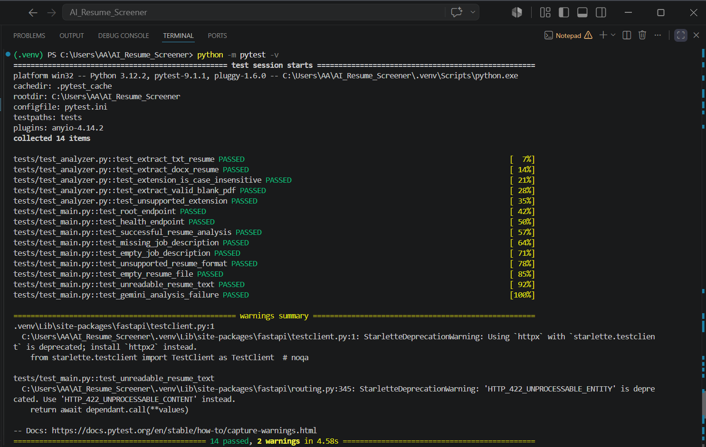

# AI Resume Screener

A full-stack AI-powered resume screening platform that compares a candidate's resume with a job description and provides truthful, practical, and actionable feedback using Google's Gemini API.

## Project Goal

The goal of this project is to help job seekers understand how closely their resume matches a specific job opportunity.

The application provides:

- A match score from 0 to 100
- Missing keywords and relevant skills
- Section-specific improvement suggestions
- Truthful resume rewrite recommendations
- A recommended resume template
- A complete resume builder with export options

The system is designed to avoid inventing qualifications, skills, or experience. Gemini is instructed to create suggested rewrites using only information already present in the uploaded resume.

## Features

### AI Resume Analysis

- Upload resumes in PDF, DOCX, PNG, JPG, JPEG, or WEBP format
- Maximum resume size of 50 MB
- Extract text from PDF and DOCX documents
- Use Gemini document understanding for images and scanned PDFs
- Paste a job description directly into the form
- Upload a job description as PDF, DOCX, TXT, PNG, JPG, JPEG, or WEBP
- Maximum job-description file size of 20 MB
- Drag-and-drop file upload
- Cancel an analysis while it is running
- Reset the workspace and start another analysis

### Analysis Results

- Match score from 0 to 100
- Missing keywords and skills
- Section-by-section issue explanations
- Truthful suggested rewrites
- Recommended resume-template type
- Explanation of why the template is suitable
- Practical template advice
- Copyable rewrite suggestions
- Download option for the originally uploaded resume

### Resume Builder

- Create and edit a complete resume
- Live resume preview
- Save resume drafts in the browser
- Use profile information to prefill resume details
- Select from six resume types:
  - Chronological
  - Functional
  - Combination
  - Targeted
  - Academic CV
  - Creative Portfolio
- Export resumes as:
  - PDF
  - Word document
  - HTML
  - Plain text

### User Workspace

- Browser-local account registration and login
- Separate data for each account created in the browser
- Protected profile, history, and resume-builder pages
- Analysis history for signed-in users
- Editable profile information
- Profile-picture upload
- Direct profile-picture camera capture
- Saved resume drafts
- Saved analysis results

> Authentication and user data storage are implemented locally in the browser for demonstration purposes. A production version should use secure server-side authentication, authorization, and database storage.

### Themes and Interface

- Responsive multipage interface
- Animated navigation bar
- Route-aware navigation indicator
- Custom loading animations
- Custom cursor effects
- Responsive mobile layout
- Custom not-found page
- Six light themes:
  - Light Peach
  - Light Beige
  - Light Rose
  - Light Violet
  - Light Blue
  - Light Green
- One Night Mode theme

## Application Pages

- Home
- Features
- Analyze Resume
- Resume Templates
- Resume Builder
- Analysis History
- User Profile
- Login
- Signup
- Custom Not Found page

## Tech Stack

### Frontend

- Next.js 16
- React 19
- TypeScript
- Tailwind CSS 4
- Browser Local Storage
- IndexedDB

### Backend

- FastAPI
- Uvicorn
- Google Gemini API
- `google-genai`
- Pydantic
- `pypdf`
- `python-docx`
- `python-multipart`
- `python-dotenv`

### Testing and Development

- Pytest
- HTTPX
- ESLint
- Next.js production build validation

## Project Structure

```text
AI_Resume_Screener/
├── frontend/
│   ├── public/
│   │   ├── images/
│   │   └── logo.svg
│   ├── src/
│   │   ├── app/
│   │   │   ├── analyze/
│   │   │   ├── features/
│   │   │   ├── history/
│   │   │   ├── login/
│   │   │   ├── profile/
│   │   │   ├── resume-builder/
│   │   │   ├── signup/
│   │   │   ├── templates/
│   │   │   ├── globals.css
│   │   │   ├── layout.tsx
│   │   │   ├── not-found.tsx
│   │   │   └── page.tsx
│   │   ├── components/
│   │   └── lib/
│   ├── .env.local
│   ├── next.config.ts
│   └── package.json
├── tests/
├── docs/
│   └── evidence/
│       ├── backend-tests-passed.png
│       └── pytest-results.txt
├── main.py
├── analyzer.py
├── gemini_service.py
├── schemas.py
├── requirements.txt
├── .env.example
└── README.md
```

## Getting Started

### 1. Clone the Repository

```bash
git clone https://github.com/malaikaa-tariq/AI_Resume_Screener.git
cd AI_Resume_Screener
```

## Backend Setup

### 2. Create a Virtual Environment

#### Windows PowerShell

```powershell
python -m venv .venv
Set-ExecutionPolicy -Scope Process -ExecutionPolicy RemoteSigned
.\.venv\Scripts\Activate.ps1
```

#### macOS or Linux

```bash
python -m venv .venv
source .venv/bin/activate
```

### 3. Install Backend Dependencies

Run this command from the project root:

```bash
pip install -r requirements.txt
```

### 4. Configure Backend Environment Variables

Copy `.env.example` to `.env`.

#### Windows PowerShell

```powershell
Copy-Item .env.example .env
```

#### macOS or Linux

```bash
cp .env.example .env
```

Open `.env` and configure the following values:

```env
GEMINI_API_KEY=replace_with_your_private_api_key
GEMINI_MODEL=gemini-3.5-flash
FRONTEND_URL=http://localhost:3000
FRONTEND_ORIGINS=http://localhost:3000,http://127.0.0.1:3000
```

Never commit the real `.env` file.

### 5. Start the Backend

Run this command from the project root:

```bash
python -m uvicorn main:app --reload --host 127.0.0.1 --port 8000
```

The backend will be available at:

- API: `http://127.0.0.1:8000`
- API documentation: `http://127.0.0.1:8000/docs`
- Health endpoint: `http://127.0.0.1:8000/health`

## Frontend Setup

### 6. Navigate to the Frontend Folder

```bash
cd frontend
```

### 7. Install Frontend Dependencies

```bash
npm install
```

### 8. Configure Frontend Environment Variables

Create a file named `.env.local` inside the `frontend` folder:

```env
NEXT_PUBLIC_API_URL=http://127.0.0.1:8000
```

Never commit `frontend/.env.local`.

### 9. Start the Frontend

```bash
npm run dev
```

Open the application in your browser:

```text
http://localhost:3000
```

Keep both the backend and frontend terminals open while using the application.

## Environment Variables

### Backend `.env`

| Variable | Description | Example |
|---|---|---|
| `GEMINI_API_KEY` | Private Google Gemini API key | `replace_with_your_api_key` |
| `GEMINI_MODEL` | Gemini model used for analysis | `gemini-3.5-flash` |
| `FRONTEND_URL` | Main frontend origin allowed by CORS | `http://localhost:3000` |
| `FRONTEND_ORIGINS` | Additional comma-separated frontend origins | `http://localhost:3000,http://127.0.0.1:3000` |

### Frontend `.env.local`

| Variable | Description | Example |
| `NEXT_PUBLIC_API_URL` | URL of the FastAPI backend | `http://127.0.0.1:8000` |

> Never commit real `.env` or `.env.local` files. Only placeholder example files should be tracked in Git.

## Backend Validation

### Python Compilation Check

Run this command from the project root:

```bash
python -m py_compile main.py gemini_service.py schemas.py analyzer.py
```

## Running Backend Tests

Run the test suite from the project root:

```bash
pytest
```

## Backend Test Evidence

The backend test suite covers resume extraction, API health checks, file validation, empty input handling, successful analysis, and Gemini failure handling.

**Test result: 14 passed**



The complete test output is available in:

```text
docs/evidence/pytest-results.txt
```

## Frontend Validation

Navigate to the frontend folder:

```bash
cd frontend
```

### Run ESLint

```bash
npm run lint
```

### Create a Production Build

```bash
npm run build
```

### Run the Production Build

```bash
npm run start
```

## API Endpoints

| Method | Endpoint | Description |
| `GET` | `/` | Confirms that the backend is running |
| `GET` | `/health` | Returns backend health status |
| `POST` | `/analyze` | Analyzes a resume against a job description |

## Security

- Real Gemini API keys are not committed
- `.env` and `.env.local` files are ignored by Git
- Uploaded files are saved temporarily
- Temporary files are removed after processing
- File extensions and upload sizes are validated
- Gemini rewrite suggestions are checked for truthfulness
- User history, profile information, and drafts are separated by browser account
- Browser-local authentication is intended for demonstration purposes only

## GitHub Workflow

The project follows this branching strategy:

- `main` — stable release branch
- `dev` — development and integration branch
- `feature/*` — individual feature branches

### Development Rules

- Do not push feature work directly to `main`
- Create feature branches from `dev`
- Push completed work to a `feature/*` branch
- Open a pull request from the feature branch into `dev`
- Request a review from another collaborator
- The pull-request author should not merge their own pull request
- Merge `dev` into `main` only through a reviewed pull request 


